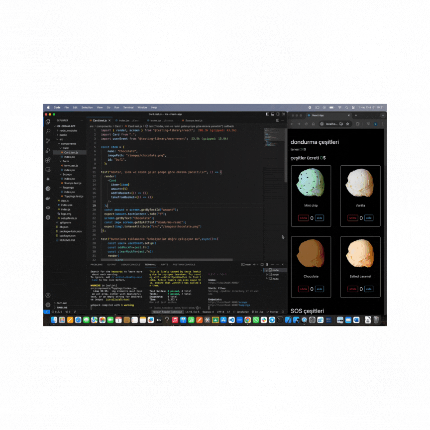

🚀 Herkese merhaba! dondurma sipariş sitesi için hazırladığım React projesini heyecanla paylaşıyorum!  Bugün, kod geliştirme sürecinde sıkça kullanılan kütüphaneler ve test yöntemleri üzerine biraz sohbet edelim. 

### 📚 Kodlama Dünyasından Kütüphaneler ve Test Süreçleri 🛠️

 ### 📦 Kütüphaneler : 

- Proje geliştirirken kullandığımız araçlar büyük önem taşır. Bu projemde `json-server`, `bootstrap`, `axios` ve `@testing-library/user-event` gibi kütüphanelerle işimizi kolaylaştırdık.

### 🔍 Selectors - Seçiciler: 

- Testlerimizi daha etkin hale getiren ve HTML elementlerini çağırmamıza olanak sağlayan yöntemler. Bu süreçte `screen` aracılığıyla kullanılıyorlar.

### 🎭 HTML Element Rolleri: 

- Her HTML elementinin bir rolü var ve bu roller, erişilebilirlik açısından da son derece önemlidir. Bu konuda daha fazla bilgi almak için [MDN dokümanlarına](https://developer.mozilla.org/en-US/docs/Web/Accessibility/ARIA/Roles) göz atabilirsiniz.

### 🎯 Matchers: 

- `expect` komutuyla birlikte kullanılan ve elementler üzerinde beklenen davranışları ifade eden methodlar. Testlerimizi daha anlamlı hale getiriyorlar. [Jest-Dom Matchers](https://github.com/testing-library/jest-dom) ve [Diğerleri](https://jestjs.io/docs/using-matchers) hakkında detaylı bilgi için linklere göz atabilirsiniz.

### 🛠️ Test Geliştirme Süreci: 

- Test Driven Development (TDD) ve Behaviour Driven Development (BDD) gibi metodlarla yazılım geliştirme sürecini optimize ediyoruz. Hangi yaklaşımı tercih ederseniz edin, testler yazılımızın kalitesini artırıyor ve geliştirme sürecini daha güvenilir hale getiriyor.

### 🔥 FireEvent vs UserEvent: 

- Testlerde olayları tetikleme sürecinde `fireEvent` ve `userEvent` arasında tercih yapmak önemli. `userEvent`, gerçek kullanıcı davranışlarını simüle ederek testlerin daha doğru sonuçlar vermesini sağlar.

### 🍦 Sonuç: 

- Bu bilgiler ışığında,  Kod geliştirme sürecinde kullandığım araçlar ve test yöntemleri hakkında daha fazla bilgi almak için profilimi ziyaret etmeyi unutmayın. Siz de kodlama dünyasında daha ileri gitmek istiyorsanız, bu tekniklerden faydalanabilirsiniz! 💻✨

#React #TestAutomation #WebDevelopment #Accessibility #CodeQuality

